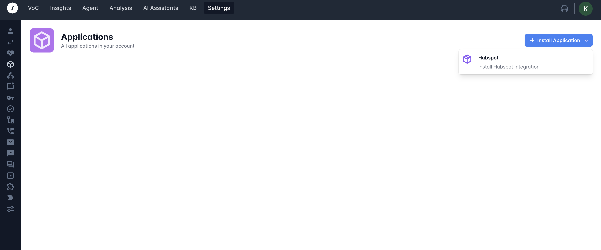
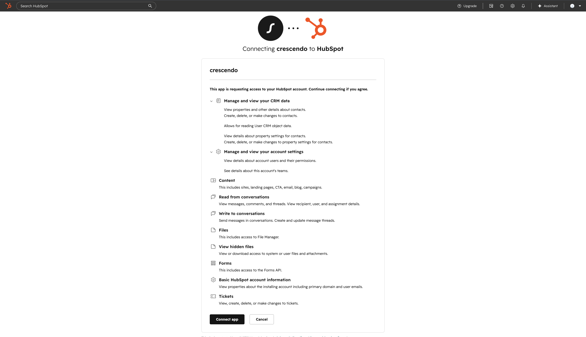
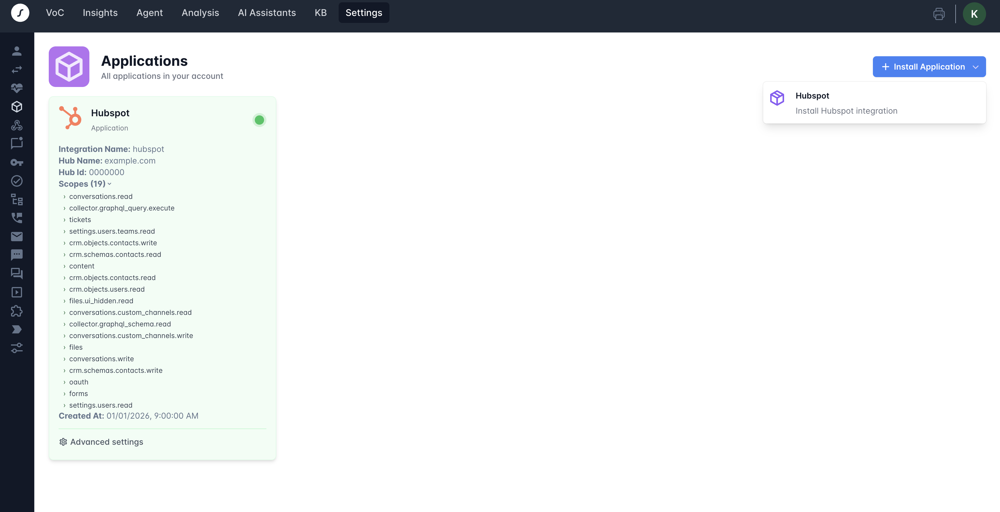

Updated June 11, 2026

Connect HubSpot to Crescendo when you want your AI assistants to use HubSpot as a connected support and CRM system.

The integration is managed from Crescendo. It does not add a UI extension, app card, or other embedded user interface inside HubSpot.

## What the connection does

Crescendo connects to HubSpot using HubSpot OAuth. You do not paste a HubSpot API key into this setup flow.

After HubSpot is connected, Crescendo can make HubSpot available to AI assistants for workflows you configure in Crescendo, such as:

| HubSpot data | How Crescendo can use it |
|--------------|--------------------------|
| Contacts and contact properties | Read customer context and update contact data when configured |
| Tickets, ticket pipelines, and ticket statuses | Create or update support tickets for assistant handoffs |
| Conversations, inboxes, and custom channels | Route handoffs and sync conversation activity |
| Users and teams | Use HubSpot owner, author, and routing context |
| Files, content, and Help Center articles | Load HubSpot knowledge content for assistant answers |

In HubSpot, a conversation may also be called a thread. HubSpot has two inbox types that may be relevant to assistant handoff workflows: **Inbox** and **Help Desk**.

## Connect HubSpot

1. Sign in to Crescendo.
2. Open **Settings > Applications**.
3. Click **Install Application**.
4. Select **HubSpot**.

<Frame caption="HubSpot install option in Crescendo">
  
</Frame>

5. In HubSpot, choose the HubSpot account you want to connect.
6. Review the requested access on the OAuth approval screen.
7. Click **Connect app**.
8. After HubSpot redirects you back to Crescendo, confirm the HubSpot application card is enabled.

<Frame caption="HubSpot OAuth scope approval screen">
  
</Frame>

The enabled HubSpot card shows the connected Hub name, Hub ID, granted scopes, and creation time.

<Frame caption="Installed HubSpot application card in Crescendo">
  
</Frame>

## Configure account settings

After HubSpot is connected, open the HubSpot advanced settings in Crescendo when you need account-level options.

To choose the HubSpot user shown on messages Crescendo sends to HubSpot threads:

1. Open **Settings > Applications**.
2. Find the enabled HubSpot application card.
3. Click **Advanced settings**.
4. Select **Thread Message Author** from your HubSpot users.
5. Save the setting.

For HubSpot email workflows, this author can be visible to end users as the sender name. If you test replies directly in HubSpot, use a HubSpot user different from the Thread Message Author so you can clearly distinguish messages sent by Crescendo from messages sent by a HubSpot agent.

## Configure AI assistant use

Connecting HubSpot makes the account available to Crescendo. You still choose how each assistant uses HubSpot.

### Handoff and tickets

Use this when you want an assistant to escalate conversations into HubSpot.

1. Open the assistant in Crescendo.
2. Open the assistant handoff settings.
3. Enable HubSpot escalation.
4. If you want Crescendo to create HubSpot tickets, enable HubSpot ticket creation.
5. Select the HubSpot ticket pipeline and statuses that match your support workflow.
6. Save and publish the assistant changes.

Crescendo can set the selected initial, escalation, and closed ticket statuses when the assistant interacts with a HubSpot ticket. If you want HubSpot to assign tickets to specific users or teams, configure that assignment in HubSpot workflows, routing rules, or inbox settings.

### HubSpot conversations

Use this when you want assistant conversations to create or sync HubSpot conversation records.

1. Open the assistant in Crescendo.
2. Open the assistant handoff settings.
3. Enable automatic HubSpot conversation creation.
4. If your workflow uses a specific HubSpot inbox, create a HubSpot channel account in Crescendo and select either the HubSpot Inbox or Help Desk inbox.
5. Save and publish the assistant changes.

When automatic HubSpot conversation creation is enabled, Crescendo needs customer contact data to find or create the HubSpot contact for the thread. Configure the assistant to collect at least an email address or phone number at startup, or pass that contact data into the assistant context.

### HubSpot email and form channels

Use this when you want a HubSpot email address or form to be handled by an AI assistant.

1. Open **Settings > Emails** in Crescendo.
2. Add a new email channel or edit an existing one.
3. Select **HubSpot** as the integration.
4. Select the AI assistant that should handle the messages.
5. Select **Email** or **Form** as the channel type.
6. Select the HubSpot email address or HubSpot form.
7. Select the sender email for assistant replies.
8. Select the HubSpot ticket pipeline and the pending, escalation, and closed statuses.
9. Save the channel configuration.

The selected pipeline and statuses control how Crescendo updates the related HubSpot ticket as the assistant replies, escalates, or closes the conversation.

### HubSpot Help Center knowledge

Use this when you want an assistant to answer from HubSpot Help Center content.

1. Open the assistant knowledge settings in Crescendo.
2. Enable **HubSpot Help Center Data**.
3. Select the Help Centers, languages, and tags you want the assistant to use.
4. Load or reload the HubSpot content.
5. Save and publish the assistant changes.

## Use the integration

Your customer-facing assistant continues to run in Crescendo. HubSpot acts as a connected system that Crescendo can read from or write to based on your assistant configuration.

Common uses include:

- Answering questions from HubSpot Help Center content
- Using HubSpot contact context during a conversation
- Creating HubSpot tickets when an assistant escalates to your team
- Creating HubSpot conversations for assistant handoffs
- Handling HubSpot email or form submissions with an AI assistant
- Keeping HubSpot ticket and conversation activity tied to the Crescendo conversation

## Disconnect or uninstall

To stop an individual assistant from using HubSpot, turn off the HubSpot options in that assistant's handoff and knowledge settings, then publish the assistant.

To remove Crescendo's account-level access to HubSpot, remove the Crescendo connected app from HubSpot's connected apps settings or contact Crescendo support.

After disconnecting or uninstalling:

- Crescendo cannot make new HubSpot requests until HubSpot is connected again.
- Existing HubSpot contacts, tickets, conversations, and content created or updated before disconnecting remain in HubSpot unless you remove them in HubSpot.
- Existing Crescendo assistant configuration remains in Crescendo, but HubSpot-dependent actions will not run until the connection is restored.

For help, contact [support@crescendo.ai](mailto:support@crescendo.ai).
