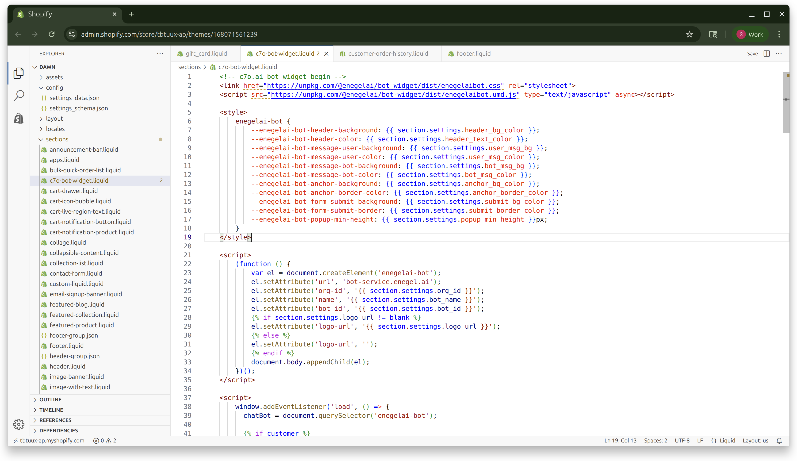
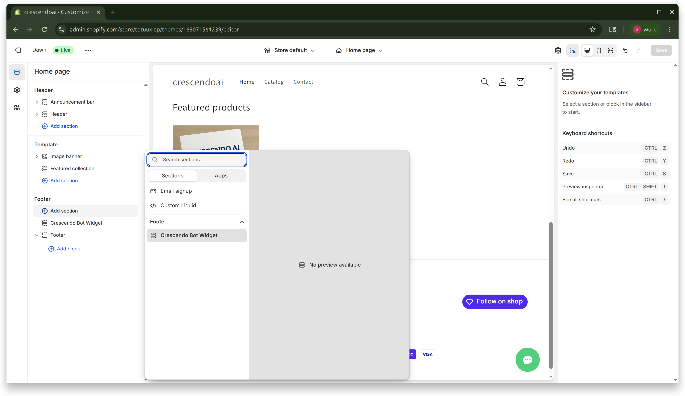
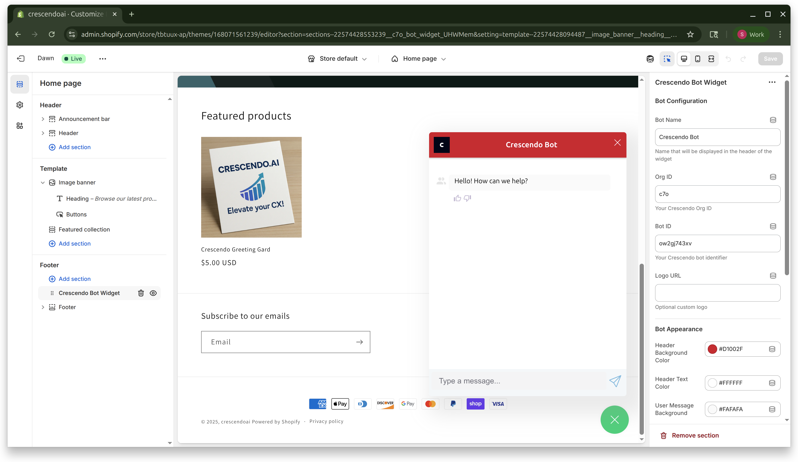

Adding the **Crescendo.ai AI Assistant** to your storefront lets shoppers chat with an AI assistant that can:

- Answer product questions 24 × 7
- Proactively surface order status, shipping updates, and more
- Pass rich customer context (email, phone, last order) directly to the bot

Even if you have a heavily-customised theme, the process below is the same—the widget lives in a Liquid **section** that you drop anywhere (we recommend the footer so it appears on every page).

## Prerequisites

| What you need | Where to get it                                                 |
|--------------|-----------------------------------------------------------------|
| **Org ID**   | Crescendo will provide                                       |
| **Bot ID**   | Crescendo.ai dashboard → **Assistants → *Your Assistant* → ID** |
| Shopify theme access | Shopify Admin → **Online Store → Themes → … → Edit code**       |
| Dawn 9.0+ (or derivative) | Any theme works; screenshots use Dawn                          |


## 1 · Create the section `c7o-bot-widget.liquid`

1. In **Shopify Admin** open **Online Store → Themes**.
2. Find your **Current theme**, click **… → Edit code**.
3. In the left sidebar, **Add a new file under `sections`**.
4. Name the file **`c7o-bot-widget.liquid`**.

 
 

5. Replace the empty file with **exactly** the code below (copy & paste _everything_, including ``):

```html
<!-- c7o.ai bot widget begin -->
<link href="https://unpkg.com/@enegelai/bot-widget/dist/enegelaibot.css" rel="stylesheet">
<script src="https://unpkg.com/@enegelai/bot-widget/dist/enegelaibot.umd.js" type="text/javascript" async></script>

<style>
    enegelai-bot {
        --enegelai-bot-header-background: {{ section.settings.header_bg_color }};
        --enegelai-bot-header-color: {{ section.settings.header_text_color }};
        --enegelai-bot-message-user-background: {{ section.settings.user_msg_bg }};
        --enegelai-bot-message-user-color: {{ section.settings.user_msg_color }};
        --enegelai-bot-message-bot-background: {{ section.settings.bot_msg_bg }};
        --enegelai-bot-message-bot-color: {{ section.settings.bot_msg_color }};
        --enegelai-bot-anchor-background: {{ section.settings.anchor_bg_color }};
        --enegelai-bot-anchor-border-color: {{ section.settings.anchor_border_color }};
        --enegelai-bot-form-submit-background: {{ section.settings.submit_bg_color }};
        --enegelai-bot-form-submit-border: {{ section.settings.submit_border_color }};
        --enegelai-bot-popup-min-height: {{ section.settings.popup_min_height }}px;
    }
</style>

<script>
    (function () {
        var el = document.createElement('enegelai-bot');
        el.setAttribute('url', 'bot-service.enegel.ai');
        el.setAttribute('org-id', '{{ section.settings.org_id }}');
        el.setAttribute('name', '{{ section.settings.bot_name }}');
        el.setAttribute('bot-id', '{{ section.settings.bot_id }}');
        
        el.setAttribute('logo-url', '{{ section.settings.logo_url }}');
        
        el.setAttribute('logo-url', '');
        
        document.body.appendChild(el);
    })();
</script>

    <script>
        // Attributions - update cart attributes with tags and note
        async function updateCartTags(tags = {}) {
          try {
            const attributes = {
              bot_conversation_id: tags?.bot_conversation_id || '',
              bot_source: tags?.bot_source || 'crescendo',
              bot_timestamp: Date.now(),
              ...tags // Allow additional custom tags
            };

            const note = "crescendo";

            const res = await fetch(`${window.Shopify.routes.root}cart/update.js`, {
              method: 'POST',
              credentials: 'same-origin',
              headers: { 
                'Content-Type': 'application/json', 
                'Accept': 'application/json' 
              },
              body: JSON.stringify({ 
                attributes,
                note: note 
              })
            });

            const cart = await res.json();
            console.log('c7o bot: Cart tags and note updated successfully', {
              attributes: cart.attributes,
              note: cart.note
            });
            return cart;
          } catch (error) {
            console.error('c7o bot: Failed to update cart tags', error);
          }
        }

        // Resolve Cart
        async function resolveStorefrontCartGid() {
          let cartId = null;
          // 1) Try the 'cart' cookie first. Since May 2024 it includes ?key=... .
          const cookieMatch = document.cookie.match(/(?:^|;\s*)cart=([^;]+)/);
          if (cookieMatch) {
            const tokenWithKey = decodeURIComponent(cookieMatch[1]);
            if (tokenWithKey.includes('?key=')) {
              cartId = `gid://shopify/Cart/${tokenWithKey}`;
            }
          }
          // 2) Fallback to Ajax Cart JSON if cookie didn't work
          if (!cartId) {
            const res = await fetch(`${window.Shopify.routes.root}cart.js`, {
              credentials: 'same-origin',
              headers: { 'Accept': 'application/json' },
              cache: 'no-store'
            });
            const cart = await res.json();
            if (cart?.token && cart.token.includes('?key=')) {
              cartId = `gid://shopify/Cart/${cart.token}`;
            }
          }
          // 3) Final fallback: "warm up" the cart with a no-op update
          if (!cartId) {
            const upd = await fetch(`${window.Shopify.routes.root}cart/update.js`, {
              method: 'POST',
              credentials: 'same-origin',
              headers: { 'Content-Type': 'application/json', 'Accept': 'application/json' },
              body: JSON.stringify({ attributes: { _bot_probe: String(Date.now()) } })
            });
            const updated = await upd.json();
            if (updated?.token && updated.token.includes('?key=')) {
              cartId = `gid://shopify/Cart/${updated.token}`;
            }
          }
          return cartId;
        }
        
        window.addEventListener('c7o:bot:conversationStart', (event) => {
          console.log('c7o bot: conversationStart - updating Cart attributes', event.detail);
          const conversationId = event?.detail?.conversationId || `conv_${Date.now()}_${Math.random().toString(36).substr(2, 9)}`;
          updateCartTags({
            bot_conversation_id: conversationId,
            bot_source: 'crescendo',
            bot_initiated: new Date().toISOString()
          });
        });

        window.addEventListener('load', async () => {
          chatBot = document.querySelector('enegelai-bot');
          const contextData = {};
          
            console.log(`c7o bot: Setting Bot Context - customer: {{ customer.email }}`);
            contextData.email = '{{ customer.email }}';
            contextData.phone = '{{ customer.phone }}';
            contextData.name = '{{ customer.name }}';
            try {
              
                contextData.last_order = {
                  order_number: '{{ customer.last_order.order_number }}',
                  created_at: '{{ customer.last_order.created_at }}',
                  order_status_url: '{{ customer.last_order.order_status_url }}',
                  fulfillment_status: '{{ customer.last_order.fulfillment_status }}',
                  line_items: []
                }
                
                    
                      contextData.last_order.line_items.push({
                        title: '{{ item.title }}',
                        quantity: {{ item.quantity }}
                      })
                    
                
                
                  contextData.last_order.fulfillment = {
                    tracking_url = '{{ customer.last_order.fulfillment.tracking_url }}'
                  }
                
              
            } catch(e) {
              console.warn('c7o bot: not able to add last order information to context',e);
            }
          
            console.log('c7o bot: Anonymous user - no customer data');
          
          // Cart ID with tagging
          try {
            // Resolve cart
            const cartId = await resolveStorefrontCartGid();
            if (cartId) {
              contextData.cart_id = cartId;
              console.log('c7o bot: Cart ID obtained', cartId);
            } else {
              console.warn('c7o bot: not able to get cartId');
            }
          } catch(e) {
            console.error('c7o bot: error getting/tagging cart', e);
          }
          chatBot.setContext(contextData);
        });
    </script>


{
  "name": "Crescendo Bot Widget",
  "tag": "section",
  "class": "section",
  "presets": [{
    "name": "Crescendo Bot Widget",
    "category": "Footer"
  }],
  "settings": [
    {
      "type": "header",
      "content": "Bot Configuration"
    },
    {
      "type": "text",
      "id": "bot_name",
      "label": "Bot Name",
      "placeholder": "Bot Widget Name",
      "default": "Crescendo Bot",
      "info": "Name that will be displayed in the header of the widget"
    },
    {
      "type": "text",
      "id": "org_id",
      "label": "Org ID",
      "info": "Your Crescendo Org ID"
    },
    {
      "type": "text",
      "id": "bot_id",
      "label": "Bot ID",
      "info": "Your Crescendo bot identifier"
    },
    {
      "type": "text",
      "id": "logo_url",
      "label": "Logo URL",
      "placeholder": "https://example.com/logo.png",
      "info": "Optional custom logo"
    },
    {
      "type": "header",
      "content": "Bot Appearance"
    },
    {
      "type": "color",
      "id": "header_bg_color",
      "label": "Header Background Color",
      "default": "#00d176"
    },
    {
      "type": "color",
      "id": "header_text_color",
      "label": "Header Text Color",
      "default": "#ffffff"
    },
    {
      "type": "color",
      "id": "user_msg_bg",
      "label": "User Message Background",
      "default": "#fafafa"
    },
    {
      "type": "color",
      "id": "user_msg_color",
      "label": "User Message Text Color",
      "default": "#000000"
    },
    {
      "type": "color",
      "id": "bot_msg_bg",
      "label": "Bot Message Background",
      "default": "#fafafa"
    },
    {
      "type": "color",
      "id": "bot_msg_color",
      "label": "Bot Message Text Color",
      "default": "#000000"
    },
    {
      "type": "color",
      "id": "anchor_bg_color",
      "label": "Anchor Background Color",
      "default": "#00d176"
    },
    {
      "type": "color",
      "id": "anchor_border_color",
      "label": "Anchor Border Color",
      "default": "#00d176"
    },
    {
      "type": "color",
      "id": "submit_bg_color",
      "label": "Submit Button Background",
      "default": "#00d176"
    },
    {
      "type": "color",
      "id": "submit_border_color",
      "label": "Submit Button Border",
      "default": "#00d176"
    },
    {
      "type": "range",
      "id": "popup_min_height",
      "label": "Popup Minimum Height",
      "min": 40,
      "max": 100,
      "step": 10,
      "default": 60,
      "unit": "px"
    }
  ]
}

```
5. Save the file.


## 2 · Add the section to the Footer

1. Click **Customize** next to your theme (opens the **Theme editor**).
2. In the left panel, scroll down and select **Footer**.
3. Click **Add Section → *Crescendo Bot Widget***.
4. **Save** the theme.




The widget won’t visibly appear in the preview yet—first you need to fill in your IDs.

---

## 3 · Enter your Org ID and Bot ID

1. In the **Theme editor**, click the **Crescendo Bot Widget** block.
2. Under **Bot Configuration**, paste your **Org ID** and **Bot ID**.
3. Optionally set **Bot Name** and **Logo URL**.
4. **Save**.




Reload the storefront—an anchor button (chat icon) should appear bottom-right. Click it to open the chat window.

---

## 4 · Customise colours and size (optional)

Every setting under **Bot Appearance** maps to a CSS custom property:

| Setting | Affects |
|---------|---------|
| Header Background/Text | Chat header bar |
| User / Bot Message BG & Color | Bubble colours |
| Anchor Background/Border | Floating button |
| Submit Button Background/Border | Buttons inside chat |


See more details in the [Enable Bot on your Website](https://docs.c7o.ai/docs/documentation/bots/enable-bot)

Experiment with the colour pickers, then **Save**. Changes are live immediately.

---

## 5 · Troubleshooting

### Widget not showing

- **IDs missing** – Ensure Org ID & Bot ID are saved (Step&nbsp;3).
- **Theme cache** – Hard-refresh (<kbd>Ctrl/⌘ + Shift + R</kbd>) after saving.

### Customers not auto-identified

The widget sets current customer context only when a visitor is **logged-in** to Shopify.  
Ask the customer to sign in or create an account first.


## You’re done! 🎉
Your Crescendo.ai bot is now embedded across every page of your store, ready to assist shoppers and boost conversions.
