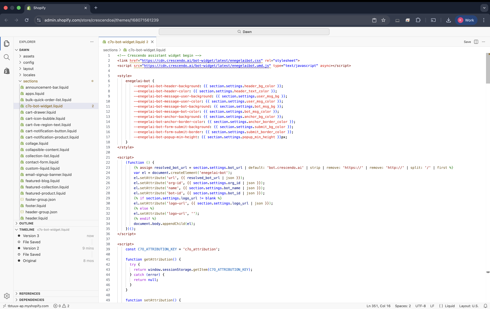
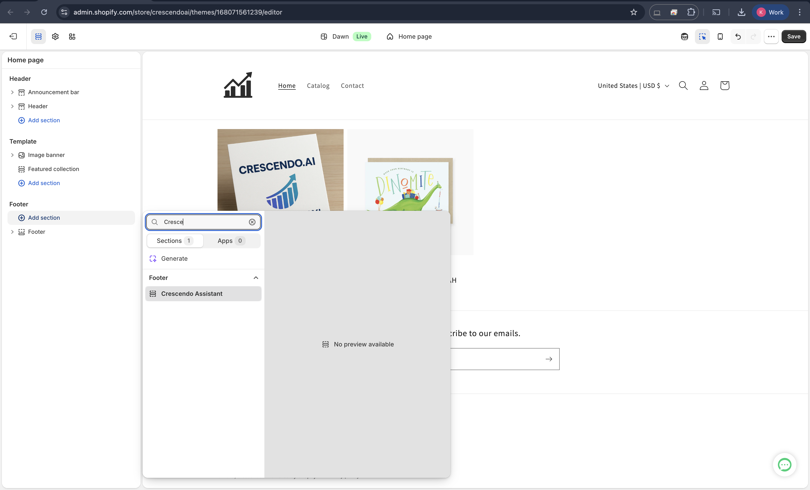
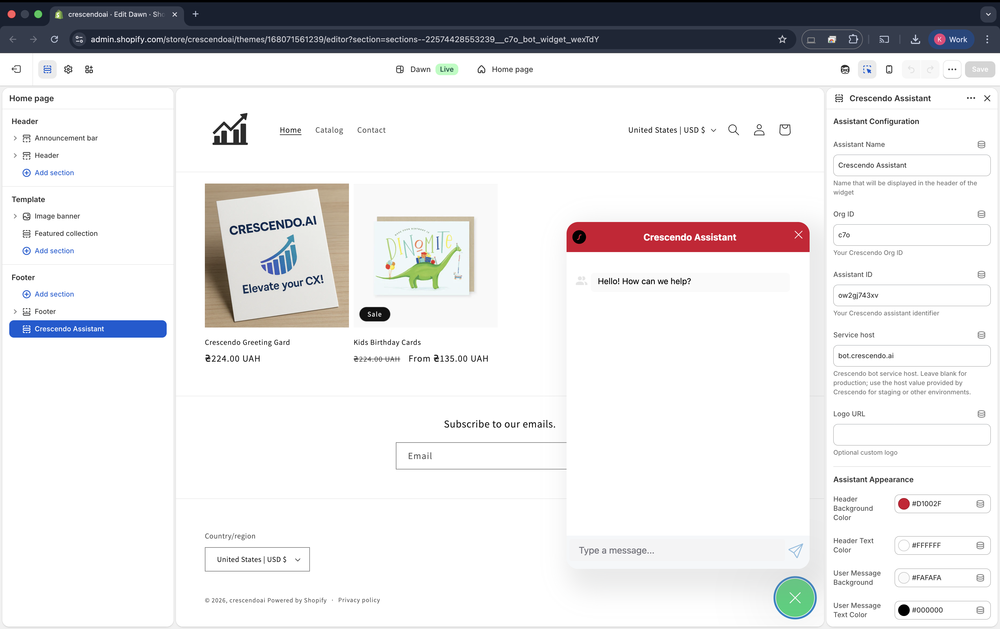

Updated April 27, 2026

Adding the **Crescendo AI Assistant** to your storefront lets shoppers chat with an AI assistant that can:

- Answer product questions 24 x 7
- Surface order status, shipping updates, and more
- Pass Shopify customer and cart context to the assistant
- Support Shopify sales attribution

Use the **Crescendo Shopify app** as the primary installation method.

The app guides you through three setup steps:

1. **Import Data**
2. **Create Assistant**
3. **Enable on Store**

Use [Advanced / Custom Theme](#advanced-custom-theme) only for custom flows, such as heavily customized themes, manual Liquid installs, custom CSS/JavaScript, or non-standard storefront requirements.

## Prerequisites

| What you need                            | Where to get it                                                                       |
|------------------------------------------|---------------------------------------------------------------------------------------|
| Crescendo Shopify app install link       | Crescendo will provide                                                                |
| Shopify app and theme access             | Shopify Admin                                                                         |
| Org ID and Assistant ID                  | Auto-populated after app install; needed only for overrides or manual Liquid installs |
| Shopify theme access for manual installs | Shopify Admin → **Online Store → Themes → ... → Edit code**                           |

For the Shopify app path, Crescendo stores the service URL, Org ID, and Assistant ID for the app. You do not need to paste those values into Shopify unless you override the default assistant or use the manual Liquid path.

## Primary method: Install the Shopify app

1. Open the Crescendo Shopify app install link.
2. Approve the Shopify OAuth installation.
3. Complete the **Welcome to Crescendo for Shopify** onboarding wizard:

| Step                           | What happens                                                                                                                                                                                                                                                                      |
|--------------------------------|-----------------------------------------------------------------------------------------------------------------------------------------------------------------------------------------------------------------------------------------------------------------------------------|
| Import Data                    | In the UI, **Import Your Shopify Store Data** imports store data for the assistant, including product catalog, store policies, collections, and store information.                                                                                                               |
| Create Assistant               | In the UI, **Create AI Assistant** creates the assistant from the Shopify template and connects it to the imported Shopify data. You will provide a company name, a short business description, and a handoff email address; the wizard wires the new assistant to the imported knowledge base and product categories. |
| Enable on Store                | In the UI, **Enable on Your Shopify Store** provides the **Enable on Shopify** one-click deep link. The link opens the Shopify theme editor with the Crescendo AI Assistant ready to activate. Click **Save** in Shopify to go live. |

4. Wait for the onboarding page to show that the assistant is connected.
5. Click **Mark as Complete**.

After setup, you can review the created knowledge base, manage categories, or customize the assistant from the onboarding page.

## Configure the app embed

The Crescendo Assistant ships as a **theme app embed** — it lives under **Theme settings → App embeds** in the theme editor (the gear icon in the side panel, or the "Apps" tab on Online Store 2.0 themes). To re-open it after onboarding:

1. In **Shopify Admin**, open **Online Store → Themes**.
2. Click **Customize** next to your current theme.
3. Click the **Theme settings** (gear) icon, then open the **App embeds** tab.
4. Find **Crescendo Assistant** and click it to expand its settings.
5. Adjust the available settings.
6. **Save** the theme.

The Shopify app exposes these common settings:

| Setting                             | Affects                                           |
|-------------------------------------|---------------------------------------------------|
| Assistant Name                      | Chat header                                       |
| Override default assistant          | Use a different Assistant ID than the app default |
| Logo Image                          | Chat header logo                                  |
| Header Background/Text              | Chat header bar                                   |
| User / Assistant Message BG & Color | Bubble colors                                     |
| Anchor Background/Border            | Floating button                                   |
| Submit Button Background/Border     | Buttons inside chat                               |
| Popup Minimum Height                | Engage popup size                                 |

If you need deeper control than the app embed offers, use the manual Liquid path:

| Need                                              | Shopify app embed | Manual Liquid |
|---------------------------------------------------|-------------------|---------------|
| App install and default IDs                       | Supported         | Manual        |
| Assistant name, logo, common colors, popup height | Supported         | Supported     |
| Full CSS custom properties                        | Not exposed       | Supported     |
| `::part()` selector styling                       | Not exposed       | Supported     |
| Custom SVG icon attributes                        | Not exposed       | Supported     |
| Custom JavaScript                                 | Not exposed       | Supported     |

## Choose where the assistant appears

By default, the app embed appears on all storefront pages where the theme app embed is enabled.

To include or exclude specific pages, ask Crescendo support to configure page rules for the assistant. These rules are not exposed in the Shopify app embed.

```json
{
  "pagesRules": {
    "enabledPages": ["^/products(/|$)", "^/collections/sale"],
    "disabledPages": ["^/account"]
  }
}
```

Each entry is first compared as an exact literal match against the current path and full URL; anything else is compiled as a regular expression (JavaScript regex literal `/pattern/flags` is also accepted). `disabledPages` wins if both lists match. If `enabledPages` is not empty, the assistant is hidden unless a rule matches. Use anchored regex patterns like `^/products(/|$)` to avoid unintended substring matches.

<a id="advanced-custom-theme"></a>

## Advanced / Custom Theme

Use this custom flow when the Shopify app embed does not provide enough theme control.

### 1 · Create the section `c7o-bot-widget.liquid`

1. In **Shopify Admin** open **Online Store → Themes**.
2. Find your **Current theme**, click **... → Edit code**.
3. In the left sidebar, **Add a new file under `sections`**.
4. Name the file **`c7o-bot-widget.liquid`**.



5. Replace the empty file with the code below:

```liquid
<!-- Crescendo assistant widget begin -->
<link href="https://cdn.crescendo.ai/bot-widget/latest/enegelaibot.css" rel="stylesheet">
<script src="https://cdn.crescendo.ai/bot-widget/latest/enegelaibot.umd.js" type="text/javascript" async></script>

<style>
    enegelai-bot {
        --enegelai-bot-header-background: {{ section.settings.header_bg_color }};
        --enegelai-bot-header-color: {{ section.settings.header_text_color }};
        --enegelai-bot-message-user-background: {{ section.settings.user_msg_bg }};
        --enegelai-bot-message-user-color: {{ section.settings.user_msg_color }};
        --enegelai-bot-message-bot-background: {{ section.settings.bot_msg_bg }};
        --enegelai-bot-message-bot-color: {{ section.settings.bot_msg_color }};
        --enegelai-bot-anchor-background: {{ section.settings.anchor_bg_color }};
        --enegelai-bot-anchor-border-color: {{ section.settings.anchor_border_color }};
        --enegelai-bot-form-submit-background: {{ section.settings.submit_bg_color }};
        --enegelai-bot-form-submit-border: {{ section.settings.submit_border_color }};
        --enegelai-bot-popup-min-height: {{ section.settings.popup_min_height }}px;
    }
</style>

<script>
    (function () {
        
        var el = document.createElement('enegelai-bot');
        el.setAttribute('url', {{ resolved_bot_url | json }});
        el.setAttribute('org-id', {{ section.settings.org_id | json }});
        el.setAttribute('name', {{ section.settings.bot_name | json }});
        el.setAttribute('bot-id', {{ section.settings.bot_id | json }});
        
        el.setAttribute('logo-url', {{ section.settings.logo_url | json }});
        
        el.setAttribute('logo-url', '');
        
        document.body.appendChild(el);
    })();
</script>

<script>
    const C7O_ATTRIBUTION_KEY = 'c7o_attribution';

    function getAttribution() {
      try {
        return window.sessionStorage.getItem(C7O_ATTRIBUTION_KEY);
      } catch (error) {
        return null;
      }
    }

    function setAttribution() {
      try {
        window.sessionStorage.setItem(C7O_ATTRIBUTION_KEY, 'crescendo');
      } catch (error) {}
    }

    function captureAttributionFromUrl() {
      const params = new URLSearchParams(window.location.search);
      if (params.get('utm_source') === 'crescendo') {
        setAttribution();
      }
    }

    async function updateCartTags(tags = {}) {
      try {
        const attributes = {
          bot_timestamp: Date.now(),
          ...tags
        };

        if (!attributes.bot_source) {
          attributes.bot_source = 'crescendo';
        }
        if (!attributes.bot_conversation_id) {
          delete attributes.bot_conversation_id;
        }

        const res = await fetch(`${window.Shopify.routes.root}cart/update.js`, {
          method: 'POST',
          credentials: 'same-origin',
          headers: {
            'Content-Type': 'application/json',
            'Accept': 'application/json'
          },
          body: JSON.stringify({
            attributes,
            note: 'crescendo'
          })
        });

        return await res.json();
      } catch (error) {
        console.error('Crescendo assistant: failed to update cart attribution', error);
      }
    }

    async function syncAttribution() {
      if (!getAttribution()) {
        return null;
      }
      return updateCartTags();
    }

    async function resolveStorefrontCartGid() {
      let cartId = null;

      const cookieMatch = document.cookie.match(/(?:^|;\s*)cart=([^;]+)/);
      if (cookieMatch) {
        const tokenWithKey = decodeURIComponent(cookieMatch[1]);
        if (tokenWithKey.includes('?key=')) {
          cartId = `gid://shopify/Cart/${tokenWithKey}`;
        }
      }

      if (!cartId) {
        const res = await fetch(`${window.Shopify.routes.root}cart.js`, {
          credentials: 'same-origin',
          headers: { 'Accept': 'application/json' },
          cache: 'no-store'
        });
        const cart = await res.json();
        if (cart?.token && cart.token.includes('?key=')) {
          cartId = `gid://shopify/Cart/${cart.token}`;
        }
      }

      if (!cartId) {
        const upd = await fetch(`${window.Shopify.routes.root}cart/update.js`, {
          method: 'POST',
          credentials: 'same-origin',
          headers: { 'Content-Type': 'application/json', 'Accept': 'application/json' },
          body: JSON.stringify({ attributes: { _bot_probe: String(Date.now()) } })
        });
        const updated = await upd.json();
        if (updated?.token && updated.token.includes('?key=')) {
          cartId = `gid://shopify/Cart/${updated.token}`;
        }
      }

      return cartId;
    }

    captureAttributionFromUrl();

    document.addEventListener('page:change', function () {
      captureAttributionFromUrl();
      syncAttribution();
    });

    document.addEventListener('shopify:section:load', function () {
      syncAttribution();
    });

    window.addEventListener('c7o:bot:conversationStart', (event) => {
      setAttribution();
      const conversationId = event?.detail?.conversationId || `conv_${Date.now()}_${Math.random().toString(36).slice(2, 11)}`;
      updateCartTags({
        bot_conversation_id: conversationId,
        bot_source: 'crescendo',
        bot_initiated: new Date().toISOString()
      });
    });

    window.addEventListener('load', async () => {
      const chatBot = document.querySelector('enegelai-bot');
      const contextData = {};

      try {
        await syncAttribution();
      } catch (error) {
        console.error('Crescendo assistant: failed to sync attribution', error);
      }

      contextData.locale = {{ request.locale.iso_code | default: localization.language.iso_code | json }};
      contextData.language = {{ localization.language.iso_code | default: request.locale.iso_code | json }};
      contextData.country = {{ localization.country.iso_code | json }};
      contextData.currency = {{ cart.currency.iso_code | default: localization.country.currency.iso_code | default: shop.currency | json }};
      contextData.market_handle = {{ localization.market.handle | default: '' | json }};

      
        contextData.email = {{ customer.email | json }};
        contextData.phone = {{ customer.phone | json }};
        contextData.name = {{ customer.name | json }};

        try {
          
            contextData.last_order = {
              order_number: {{ customer.last_order.order_number | json }},
              created_at: {{ customer.last_order.created_at | json }},
              order_status_url: {{ customer.last_order.order_status_url | json }},
              fulfillment_status: {{ customer.last_order.fulfillment_status | json }},
              line_items: []
            };

            
              
                contextData.last_order.line_items.push({
                  title: {{ item.title | json }},
                  quantity: {{ item.quantity | json }}
                });
              
            

            
              contextData.last_order.fulfillments = [{
                tracking_url: {{ customer.last_order.fulfillments.first.tracking_url | json }}
              }];
            
          
        } catch(error) {
          console.warn('Crescendo assistant: not able to add last order information to context', error);
        }
      

      try {
        const cartId = await resolveStorefrontCartGid();
        if (cartId) {
          contextData.cart_id = cartId;
        }
      } catch(error) {
        console.error('Crescendo assistant: error getting cart ID', error);
      }

      chatBot.setContext(contextData);
    });
</script>
<!-- Crescendo assistant widget end -->


{
  "name": "Crescendo Assistant",
  "tag": "section",
  "class": "section",
  "presets": [{
    "name": "Crescendo Assistant",
    "category": "Footer"
  }],
  "settings": [
    {
      "type": "header",
      "content": "Assistant Configuration"
    },
    {
      "type": "text",
      "id": "bot_name",
      "label": "Assistant Name",
      "placeholder": "Assistant Widget Name",
      "default": "Crescendo Assistant",
      "info": "Name that will be displayed in the header of the widget"
    },
    {
      "type": "text",
      "id": "org_id",
      "label": "Org ID",
      "info": "Your Crescendo Org ID"
    },
    {
      "type": "text",
      "id": "bot_id",
      "label": "Assistant ID",
      "info": "Your Crescendo assistant identifier"
    },
    {
      "type": "text",
      "id": "bot_url",
      "label": "Service host",
      "placeholder": "bot.crescendo.ai",
      "info": "Crescendo bot service host. Leave blank for production; use the host value provided by Crescendo for staging or other environments."
    },
    {
      "type": "text",
      "id": "logo_url",
      "label": "Logo URL",
      "placeholder": "https://example.com/logo.png",
      "info": "Optional custom logo"
    },
    {
      "type": "header",
      "content": "Assistant Appearance"
    },
    {
      "type": "color",
      "id": "header_bg_color",
      "label": "Header Background Color",
      "default": "#00d176"
    },
    {
      "type": "color",
      "id": "header_text_color",
      "label": "Header Text Color",
      "default": "#ffffff"
    },
    {
      "type": "color",
      "id": "user_msg_bg",
      "label": "User Message Background",
      "default": "#fafafa"
    },
    {
      "type": "color",
      "id": "user_msg_color",
      "label": "User Message Text Color",
      "default": "#000000"
    },
    {
      "type": "color",
      "id": "bot_msg_bg",
      "label": "Assistant Message Background",
      "default": "#fafafa"
    },
    {
      "type": "color",
      "id": "bot_msg_color",
      "label": "Assistant Message Text Color",
      "default": "#000000"
    },
    {
      "type": "color",
      "id": "anchor_bg_color",
      "label": "Anchor Background Color",
      "default": "#00d176"
    },
    {
      "type": "color",
      "id": "anchor_border_color",
      "label": "Anchor Border Color",
      "default": "#00d176"
    },
    {
      "type": "color",
      "id": "submit_bg_color",
      "label": "Submit Button Background",
      "default": "#00d176"
    },
    {
      "type": "color",
      "id": "submit_border_color",
      "label": "Submit Button Border",
      "default": "#00d176"
    },
    {
      "type": "range",
      "id": "popup_min_height",
      "label": "Popup Minimum Height",
      "min": 40,
      "max": 100,
      "step": 10,
      "default": 60,
      "unit": "px"
    }
  ]
}

```
6. Save the file.

### 2 · Add the section to the Footer

1. Click **Customize** next to your theme.
2. In the left panel, scroll down and select **Footer**.
3. Click **Add Section**, then choose **Crescendo Assistant** (filed under the **Footer** category in the picker).
4. **Save** the theme.



The widget will not appear until you enter your Org ID and Assistant ID. Manual Liquid installations do not use the app metafields, so you must enter these IDs yourself.

### 3 · Enter your Org ID and Assistant ID

1. In the **Theme editor**, click the **Crescendo Assistant** section.
2. Under **Assistant Configuration**, paste your **Org ID** and **Assistant ID**.
3. Optionally set **Assistant Name** and **Logo URL**.
4. **Save**.



Reload the storefront. An anchor button should appear bottom-right. Click it to open the chat window.

## Customize colors and size (optional)

Every setting under **Assistant Appearance** maps to a CSS custom property:

| Setting                             | Affects             |
|-------------------------------------|---------------------|
| Header Background/Text              | Chat header bar     |
| User / Assistant Message BG & Color | Bubble colors       |
| Anchor Background/Border            | Floating button     |
| Submit Button Background/Border     | Buttons inside chat |
| Popup Minimum Height                | Engage popup size   |

For website installs, see [Enable AI Assistant on your Website](./enable-assistant#customizing-appearance).

### Advanced styling reference

Manual Liquid installs can use any supported widget CSS custom property:

| Property                                      | Affects                                         |
|-----------------------------------------------|-------------------------------------------------|
| `--enegelai-bot-width`                        | Widget width                                    |
| `--enegelai-bot-base-font-size`               | Base font size                                  |
| `--enegelai-bot-max-height`                   | Widget max height                               |
| `--enegelai-bot-height-top-margin`            | Desktop top margin used in height calculation   |
| `--enegelai-bot-height-top-margin-sm`         | Mobile top margin used in height calculation    |
| `--enegelai-bot-header-background`            | Header background                               |
| `--enegelai-bot-header-color`                 | Header text and icon color                      |
| `--enegelai-bot-header-close-color`           | Header close icon color                         |
| `--enegelai-bot-header-close-hover-color`     | Header close icon hover color                   |
| `--enegelai-bot-message-bot-background`       | Assistant message background                    |
| `--enegelai-bot-message-bot-color`            | Assistant message text                          |
| `--enegelai-bot-message-bot-a-color`          | Links inside assistant messages                 |
| `--enegelai-bot-message-user-background`      | User message background                         |
| `--enegelai-bot-message-user-color`           | User message text                               |
| `--enegelai-bot-message-user-a-color`         | Links inside user messages                      |
| `--enegelai-bot-message-user-name-color`      | User name text                                  |
| `--enegelai-bot-message-system-background`    | System message background                       |
| `--enegelai-bot-message-system-color`         | System message text                             |
| `--enegelai-bot-message-a-visited-color`      | Visited message links                           |
| `--enegelai-bot-message-a-hover-color`        | Hovered message links                           |
| `--enegelai-bot-message-a-active-color`       | Active message links                            |
| `--enegelai-bot-form-background`              | Data collection form background                 |
| `--enegelai-bot-form-color`                   | Data collection form text                       |
| `--enegelai-bot-form-submit-background`       | Form submit button background                   |
| `--enegelai-bot-form-submit-border`           | Form submit button border                       |
| `--enegelai-bot-form-submit-color`            | Form submit button text                         |
| `--enegelai-bot-anchor-background`            | Floating anchor background                      |
| `--enegelai-bot-anchor-border-color`          | Floating anchor border                          |
| `--enegelai-bot-anchor-color`                 | Floating anchor icon color                      |
| `--enegelai-bot-anchor-shadow-color`          | Floating anchor shadow                          |
| `--enegelai-bot-anchor-shadow-hower-color`    | Floating anchor hover shadow                    |
| `--enegelai-bot-anchor-popup-position`        | Engage popup position relative to the anchor    |
| `--enegelai-bot-anchor-badge-variant`         | Unread badge variant                            |
| `--enegelai-bot-popup-background`             | Engage popup background                         |
| `--enegelai-bot-popup-color`                  | Engage popup text                               |
| `--enegelai-bot-popup-logo-color`             | Engage popup logo color                         |
| `--enegelai-bot-popup-close-color`            | Engage popup close icon color                   |
| `--enegelai-bot-popup-min-width`              | Engage popup minimum width                      |
| `--enegelai-bot-popup-max-width`              | Engage popup maximum width                      |
| `--enegelai-bot-popup-min-height`             | Engage popup minimum height                     |
| `--enegelai-bot-user-message-avatar-position` | User avatar position, such as `left` or `right` |
| `--enegelai-bot-feedback-icon-color`          | Feedback icon color                             |
| `--enegelai-bot-typing-color`                 | Typing indicator color                          |
| `--enegelai-bot-cb-icon-font-size`            | Custom icon font size                           |

Manual Liquid installs can also use `::part()` selectors:

| Area                                          | Selectors                                                                                                                                              |
|-----------------------------------------------|--------------------------------------------------------------------------------------------------------------------------------------------------------|
| Wrapper                                       | `wrapper`                                                                                                                                              |
| Header                                        | `header`, `header-logo`, `header-title`, `header-close`                                                                                                |
| Message list                                  | `bot-message-list`, `disclaimer-message`, `bot-message`, `cb-message`, `bot-message-content`, `user-message-content`                                   |
| Avatars                                       | `user-avatar`, `assistant-avatar`                                                                                                                      |
| Feedback                                      | `feedback-wrapper`, `feedback-up`, `feedback-down`                                                                                                     |
| Forms                                         | `form`, `form-title`, `form-input`, `form-submit`                                                                                                      |
| New conversation                              | `new-conversation-wrapper`, `new-conversation-button`                                                                                                  |
| Audio controls (when audio is enabled)        | `audio-controls-wrapper`, `audio-controls`, `audio-mute-button`, `audio-unmute-button`, `audio-end-button`, `audio-controls-viz`                       |
| Anchor                                        | `anchor`, `anchor-badge`, `anchor-icon`                                                                                                                |
| Input                                         | `user-input-control`, `user-input`, `user-input-wrapper`, `user-input-base`, `user-input-textarea`, `user-input-buttons-wrapper`, `user-input-send-icon`, `user-input-attach-icon` |
| Input (when audio input is enabled)           | `user-input-inner`, `upload-button`, `control-button`                                                                                                  |

The widget renders inside a shadow DOM, so style each part through the `::part()` selector on the host element:

```css
enegelai-bot::part(header) {
  background: #111;
  color: #fff;
}

enegelai-bot::part(anchor):hover {
  transform: scale(1.05);
}

/* Apply attribute selectors to the host element, not the part */
enegelai-bot[always-open]::part(anchor) {
  display: none;
}
```

Pseudo-classes such as `:hover` and `:focus` apply directly to the part. Attribute selectors must be placed on the host element, before `::part()`. Descendant combinators do not cross the shadow boundary — target each part independently.

You can also configure widget attributes in manual Liquid. The Shopify snippets above use `name`, `url`, `org-id`, `bot-id`, and `logo-url`. Custom icon and logo attributes, such as `logo-svg`, `popup-logo-svg`, `popup-logo-url`, `bot-icon-svg`, `agent-icon-svg`, `user-icon-svg`, `system-icon-svg`, `info-icon-svg`, `anchor-open-svg`, `anchor-close-svg`, `send-icon-svg`, `attach-icon-svg`, and `close-svg`, require manual control.

For additional widget parameters and events, see [Enable AI Assistant on your Website](./enable-assistant).

## Customer context

The widget passes Shopify context to the assistant when the data is available:

| Context                                                      | Availability                                      |
|--------------------------------------------------------------|---------------------------------------------------|
| `email`, `phone`, `name`                                     | Logged-in Shopify customers                       |
| `last_order`                                                 | Logged-in Shopify customers with a previous order |
| `cart_id`                                                    | When the storefront cart can be resolved          |
| `locale`, `language`, `country`, `currency`, `market_handle` | Storefront context                                |

When `last_order` is populated, it includes:

| Field                                         | Source                                   |
|-----------------------------------------------|------------------------------------------|
| `order_number`                                | `customer.last_order.order_number`       |
| `created_at`                                  | `customer.last_order.created_at`         |
| `order_status_url`                            | `customer.last_order.order_status_url`   |
| `fulfillment_status`                          | `customer.last_order.fulfillment_status` |
| `line_items[].title`, `line_items[].quantity` | Each line item on the last order         |
| `fulfillments[0].tracking_url`                | Set only if the first fulfillment has a tracking URL |

The assistant can use this context for personalized support, order-status answers, localized responses, cart-aware shopping help, and attribution checks. Anonymous shoppers can still chat, but customer identity and order history are not available until they sign in.

If you need the assistant to use product metafields, configure product metafield definitions in the Shopify knowledge source or ask Crescendo to enable them for your store.

## Attribution events

The widget listens for `c7o:bot:conversationStart`. When a shopper sends the first message, the snippet calls `updateCartTags()` and writes Crescendo attribution to the Shopify cart. The snippet also marks sessions when a shopper lands on a link that includes `utm_source=crescendo`.

See [Shopify Attribution](./shopify-attribution) for Flow setup and reporting.

## Troubleshooting

### Widget is not showing

- **App embed disabled** – Ensure the Crescendo Assistant app embed is enabled in **Theme settings → App embeds** and the theme is saved.
- **IDs are missing** – For manual Liquid installations, ensure Org ID and Assistant ID are saved.
- **Page rules** – Check whether page rules hide the assistant on the current URL.
- **Theme cache** – Hard-refresh (<kbd>Ctrl/⌘ + Shift + R</kbd>) after saving.

### Customer details are not available

Customer context is available only when Shopify already identifies the visitor as a logged-in customer. Anonymous shoppers can still chat, but the assistant will not receive email, phone, name, or order history until the shopper signs in through the store's normal account flow.

### Cart ID or attribution is missing

- Confirm the storefront allows requests to `/cart.js` and `/cart/update.js`.
- For link-click attribution, assistant product, cart, or checkout links must include `utm_source=crescendo`.
- See [Shopify Attribution](./shopify-attribution) for attribution setup and verification.

## You’re done!

Your Crescendo assistant is now embedded in your Shopify store.
