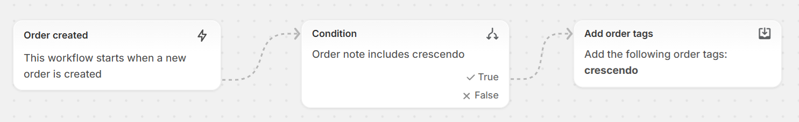

# Sales Attribution

It is important to be able to correlate Chat Assistant conversations with consequent Shopping Cart activities and Orders. 

Just three simple steps enable to create a standard Shopify Report demonstrating how many orders were created after a customer talked to Chat Assistant":
* install Chat Assistant Widget
* create Shopify Flow to convert order notes to tags
* add a filter to out-of-box Shopify Report

# Install Chat Assistant Widget

Add the **Crescendo.ai Bot** to your storefront as described here: [Enable Bot on your Shopify Store](./enable-bot-shopify-store.md).

# Create Shopify Flow to convert order notes to tags

The Chat Assistant Widget attaches notes to each shopping cart and order that was created after a customer comminicated with the Chat Assistant. In order to use standatd out-of-box Shopify Reports it is required to convert Order Notes to Tags.

You will receive a .flow file that contains the required flow. 

* Add Flow app in Shopify Admin, if it is not yet added
* Import this .flow file
* Make sure that it looks like this: 

# Add a filter to out-of-box Shopify Report

* Open a standard Analytics / Report named **"Orders fulfilled by day"**
* Go to the bottom right of the screen and add a filter **Order tags contains crescendo**

## You’re done!
Now you can watch Shopify Reports and see how many orders were placed after a conversations with Chat Assistant
