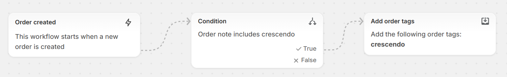

Updated April 27, 2026

# Sales Attribution

It is important to correlate Chat Assistant conversations with shopping cart activity and orders.

Three steps enable a standard Shopify report showing how many orders were created after a customer talked to the Chat Assistant:

* install Chat Assistant Widget
* create Shopify Flow to convert order notes to tags
* add a filter to a standard Shopify report

# Install Chat Assistant Widget

Add the **Crescendo AI Assistant** to your storefront as described here: [Enable AI Assistant on your Shopify Store](./enable-assistant-shopify-store).

# Create Shopify Flow to convert order notes to tags

The Chat Assistant Widget attaches attribution to the cart after a shopper starts a conversation. It can also mark sessions when assistant links include `utm_source=crescendo`.

When the widget receives the `c7o:bot:conversationStart` event, it calls `updateCartTags()`. That function updates the Shopify cart through `/cart/update.js` with note `crescendo` and cart attributes such as:

| Attribute             | Description                                   |
|-----------------------|-----------------------------------------------|
| `bot_conversation_id` | Conversation ID, when available               |
| `bot_source`          | Attribution source, usually `crescendo`       |
| `bot_timestamp`       | Time the cart attribution was written         |
| `bot_initiated`       | Time the conversation-start event was handled |

Shopify carries the cart note to the order. To use standard Shopify reports, convert that order note to an order tag with Shopify Flow.

1. Add the **Shopify Flow** app in Shopify Admin if it is not already installed.
2. Create a new workflow.
3. Use **Order created** as the trigger.
4. Add a condition: **Order note includes `crescendo`**.
5. On the **True** path, add **Add order tags** with tag `crescendo`.
6. Turn on the workflow.

Make sure that it looks like this. The screenshot shows the **Order created** trigger, the **Order note includes `crescendo`** condition, and the **Add order tags** action.

# Add a filter to a standard Shopify Report

* Open a standard Analytics report, such as **Orders fulfilled by day** or **Orders over time**.
* Add a filter: **Order tags contains `crescendo`**.
* Save the report if you want to reuse it.

# Verify attribution

Before relying on the report, place a test order. The widget must be installed, the cart must exist or be resolvable before checkout, and the shopper session must be marked by a conversation start or by a link with `utm_source=crescendo`.

* Start a new assistant conversation, or click an assistant-provided product/cart/checkout link that includes `utm_source=crescendo`.
* Add a product to the cart and place a test order.
* Open the order in Shopify Admin and confirm the order note contains `crescendo` or the order additional details include Crescendo attribution attributes.
* Confirm the Shopify Flow run succeeded.
* Confirm the order has the `crescendo` tag and appears in the filtered report.

# Reporting beyond the basic filter

The `crescendo` order tag can be used for more than the **Orders fulfilled by day** report:

* Revenue attributed to the assistant: filter sales reports by **Order tags contains `crescendo`**.
* Conversion comparison: compare tagged orders with total storefront orders for the same date range.
* Product or collection performance: filter product sales reports by the `crescendo` tag.
* Orders by conversation intent: combine Shopify tagged orders with Crescendo conversation reporting outside Shopify.

# Known limitations

* Attribution starts only after the widget loads and marks the session.
* Link-click attribution requires assistant links to include `utm_source=crescendo`.
* Anonymous shoppers do not provide customer identity context.
* If a shopper checks out before a cart exists or before the cart update completes, the order may not be tagged.
* Browser storage or script blockers can prevent attribution from persisting across pages.
* Custom storefronts or custom cart flows must still allow Shopify cart updates before checkout.

## You’re done!

Now you can use Shopify reports to see how many orders were placed after a conversation with the Chat Assistant.
