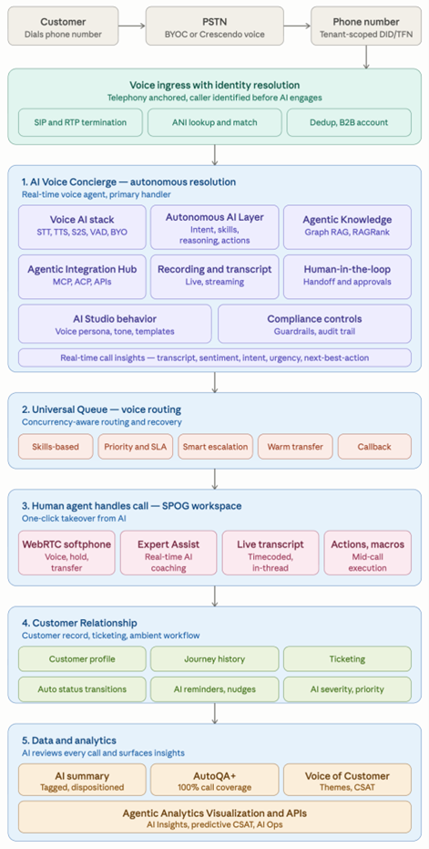
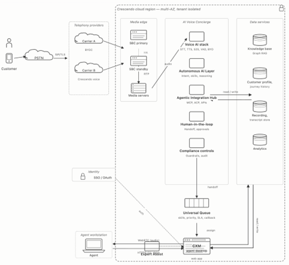

<Warning>
Confidential & Proprietary.
The information contained in this document is confidential and proprietary to Crescendo. By accepting this document, the recipient agrees not to disclose, copy, or distribute any part of it to any third party without Crescendo’s prior written permission.
</Warning>

# Crescendo Telephony

Crescendo Telephony connects traditional phone networks to Crescendo voice experiences. It gives you one model for handling inbound calls while Crescendo abstracts the underlying telephony infrastructure.

You can use Crescendo Telephony to:

- accept inbound calls
- make outbound calls when the business needs to call the customer back, for example after an interrupted call
- route callers into AI and human-assisted workflows
- carry call context into Crescendo conversations and operational workflows

## Overview

At a high level, Crescendo Telephony bridges external phone systems and SIP-based connectivity into the Crescendo platform.

This lets you build voice experiences that can:

- answer incoming calls
- connect callers to AI assistants
- hand calls off to teams, agents, or downstream destinations when needed

Crescendo is designed to keep the call-handling model consistent even when the underlying carrier, SIP provider, or media infrastructure varies by environment.

### Phone numbers

Crescendo Telephony can work with phone numbers and telephony entry points that are connected into your Crescendo environment.

Depending on how your deployment is configured, Crescendo can use:

- numbers provisioned through an integrated telephony provider
- numbers managed outside Crescendo and connected through SIP
- telephony entry points dedicated to inbound call handling

## Telephony Components

### Call participant

Each live call has a phone-side participant that represents the caller or callee inside Crescendo.

You can think of this participant as the telephony identity attached to the live voice session. It carries the context Crescendo needs to manage the call inside a broader conversation or routing workflow.

### Provider connection

Crescendo connects to external telephony systems through provider-facing connectivity, typically using SIP-based integrations.

Depending on how your environment is set up, this connection layer is what allows Crescendo to:

- receive inbound calls from external phone systems
- exchange signaling and media securely

### Routing rules

Routing rules determine what Crescendo should do with an inbound call.

For example, routing rules can decide:

- which workflow should answer the call
- whether multiple calls should enter the same destination or different destinations
- what context or metadata should be attached when the call enters Crescendo

## SIP Capabilities

Crescendo Telephony is designed for SIP-based interoperability. The exact capabilities available to you depend on your provider connection, environment configuration, and security requirements.

Common SIP and media capabilities in Crescendo telephony deployments include:

| Capability | Typical use in Crescendo |
| --- | --- |
| `SIP over UDP` | Basic SIP signaling where UDP transport is acceptable. |
| `SIP over TCP` | SIP signaling where TCP transport is preferred or required. |
| `SIP over TLS` | Encrypted SIP signaling for security-sensitive deployments. |
| `DTMF` | Touch-tone input for menus, routing, verification, and self-service flows. |
| `Caller ID` | Passing and interpreting phone identity for inbound calls. |
| `SIP OPTIONS` | Connectivity and endpoint health checks between systems. |
| `RTP` | Audio media transport for live calls. |
| `SRTP` | Encrypted media transport for secure call audio. |
| `Inbound call routing` | Accepting calls from external phone networks into Crescendo workflows. |
| `Call transfer workflows` | Redirecting a live call to another destination, team, or endpoint. |

Some SIP features may be limited, optional, or provider-dependent in your environment. Treat your deployed configuration as the source of truth for what is available in production.

## Key Concepts

Understand these concepts before you build telephony workflows in Crescendo.

### Features

Crescendo Telephony can be used as the foundation for production voice workflows that combine AI, routing, and operational controls. Common telephony features include:

- DTMF handling
- caller identification
- call transfers
- secure signaling and media
- region-aware call routing
- audio quality enhancements such as noise reduction
- AI-first call answering with human handoff

### Accepting calls

Inbound calling is the flow where an external caller reaches a Crescendo-managed entry point and Crescendo decides how to handle the call.

In a typical inbound flow:

1. A caller dials a phone number.
2. The call reaches Crescendo through the configured telephony connection.
3. Crescendo creates the phone-side call participant.
4. Crescendo applies the routing rules for that entry point.
5. The call is sent to the correct AI, agent, team, or destination.

### AI and human handoff

Crescendo Telephony is built for mixed AI and human call handling.

You can use AI to answer first, collect information, resolve simple requests, and decide whether the call should stay automated or be handed off. When a handoff is needed, Crescendo can route the live call into the correct operational workflow without changing the overall customer experience.

## Service Architecture

Crescendo Telephony typically relies on four layers working together:

1. A phone number or external telephony entry point.
2. A provider connection layer that carries signaling and media.
3. Crescendo services that validate routing, create call participants, and manage active call state.
4. The Crescendo experience layer where AI, agents, conversations, and workflows handle the call.

This separation is important because it lets Crescendo present a unified telephony experience without tying your operational model to a single telephony vendor.

## Using Crescendo Telephony

Crescendo Telephony is intended to work across different provider setups rather than forcing a single telephony vendor model.

In practice, this means you can use Crescendo to:

- connect existing SIP-based telephony infrastructure
- standardize inbound call handling
- keep AI and human workflows consistent across providers
- treat telephony connectivity as infrastructure while Crescendo owns the customer experience layer

### Noise reduction for calls

Some Crescendo telephony deployments can incorporate audio enhancement or noise reduction capabilities to improve call quality in noisy environments.

This is especially useful for:

- improving caller intelligibility
- improving speech recognition and transcription quality
- reducing friction in AI-led conversations
- improving recording quality for review and analytics

Availability depends on the telephony and media services configured in your environment.

## Getting Started

To get started with Crescendo Telephony, you generally need to:

1. Set up the phone number or telephony entry point you want callers to use.
2. Configure the provider connection used for inbound calling.
3. Define the routing rules for how inbound calls should enter Crescendo.
4. Configure the AI, human routing, or downstream destinations that should handle the call.
5. Test inbound call flows before putting them into production.

### SIP trunk setup

If you connect Crescendo Telephony through a SIP trunk provider, Crescendo is typically 
deployed with third-party SIP trunking providers such as Twilio, Telnyx, Plivo, and Wavix. 
Compatibility depends on the exact provider configuration and the telephony environment backing your Crescendo deployment.

#### External provider setup

The usual setup steps with an external SIP trunk provider are:

1. Create a SIP trunk with your provider.
2. Add authentication or restrict trunk usage by allowed phone numbers or source IP addresses.
3. Purchase or assign the phone number that should receive inbound calls.
4. Associate that number with the SIP trunk.
5. Configure the provider to send calls to the SIP endpoint used by your Crescendo telephony environment.

Depending on the provider, you may need to configure a SIP endpoint instead of a full SIP URI. In that case, use the hostname portion of the SIP address required by your Crescendo telephony environment.

After the external trunk is connected, you typically create an inbound configuration for accepting calls and define 
the routing rule that decides where each inbound call should go. This keeps the provider-specific trunking details 
in the connectivity layer while Crescendo controls call routing and call handling behavior.

### Team

A team is a routing and ownership group for agents. Teams are used to organize queues, route work by expertise, and give team leads a clear operational scope.

### Category

A category is the classification CXM uses to understand what a conversation is about, such as Billing, Refunds, Technical Support, or Account Access.

Categories help CXM:

- label conversations consistently
- drive routing decisions
- organize queues
- report on support demand and outcomes

## Crescendo Telephony Architecture

## Voice call flow

- Customer dials support number, call arrives and gets routed via Crescendo voice to a tenant-scoped phone number.
-	Ingress + identity - SIP/RTP anchors the call; ANI lookup identifies the caller (or flags them anonymous/B2B/dedup) before AI engages.
-	AI Voice Concierge Agent(s) handles the call - primary resolver, not deflection. Runs STT/TTS/S2S/VAD for audio, Autonomous AI Layer for reasoning, Agentic Knowledge for grounded answers, skills for actions and Agentic Integration Hub for taking actions in external systems, with live recording, transcript and real-time summarization, human-in-the-loop handoff rules and compliance guardrails throughout.
-	Universal Queue routes to a human when needed - skills, priority, smart escalation, warm transfer, or callback.
-	Agent takes over in SPOG - WebRTC softphone, Expert Assist coaching, live transcript, mid-call actions/macros. One-click takeover from the AI.
-	Customer Relationship updates live - profile, journey history, and ticket stay current with auto status transitions, AI nudges, and AI-assigned severity and priority.
-	Data and analytics reviews every call - AI summary, AutoQA+ at 100% coverage, Voice of Customer themes, all exposed through Agentic Analytics APIs.

## Why This Model Matters

You should be able to design your voice experience around the customer journey, not around a specific telephony vendor.

Crescendo Telephony gives you a consistent way to reason about call entry points, routing, participants, and handoff flows while the underlying telephony infrastructure remains implementation detail.
